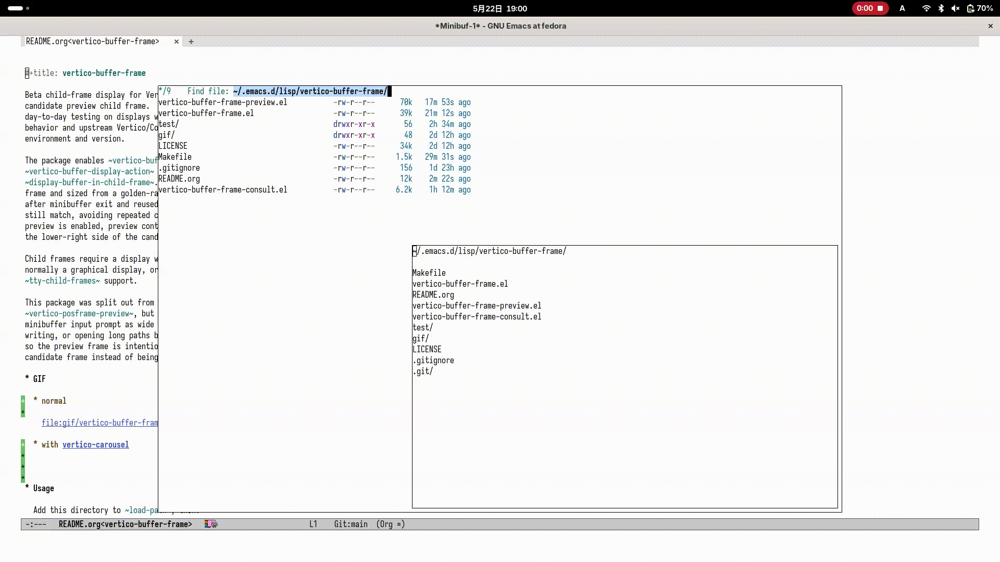

#+title: vertico-buffer-frame

Child-frame display for Vertico's ~vertico-buffer-mode~.

Vertico and ~vertico-buffer-mode~ render the candidates.  This package only
changes ~vertico-buffer-display-action~ so the Vertico buffer appears in a
centered child frame.  The implementation intentionally stays small: one
golden-ratio-sized candidate frame per minibuffer session, cleanup on
minibuffer exit, and fallback to the previous Vertico buffer display action when
child frames are unavailable or fail.

When Consult is loaded, Consult's ordinary preview is mirrored in a second
non-focusable child frame.  The preview frame is overlaid on the lower-right of
the candidate frame and sized from the candidate frame using the golden ratio.
Consult insertion previews, such as ~consult-yank-from-kill-ring~, are mirrored
from Consult's window-local preview overlay.

* GIF

** normal

[[file:gif/vertico-buffer-frame.gif]]

** with [[https://github.com/kn66/vertico-carousel][vertico-carousel]]

* Usage

Add this directory to ~load-path~, then:

#+begin_src elisp
  (require 'vertico-buffer-frame)
  (vertico-buffer-frame-mode 1)
#+end_src

For per-command or per-category use with ~vertico-multiform-mode~, enable the
local mode from a multiform rule instead of enabling the global mode:

#+begin_src elisp
  (require 'vertico-buffer-frame)
  (setq vertico-multiform-commands
        '((consult-line buffer-frame-local))
        vertico-multiform-categories
        '((file buffer-frame-local)))
  (vertico-multiform-mode 1)
#+end_src

The symbol ~buffer-frame-local~ resolves to
~vertico-buffer-frame-local-mode~ in Vertico multiform rules.

The candidate frame does not accept focus by default.  This avoids backend
issues where deleting a focused child frame loses Emacs input focus.  If you
want mouse clicks or wheel events in the candidate frame, enable focus
explicitly:

#+begin_src elisp
  (setq vertico-buffer-frame-candidate-accept-focus t)
  (vertico-mouse-mode 1)
#+end_src

When child frames are unavailable or display fails, the package falls back to
the ~vertico-buffer-display-action~ that was active before
~vertico-buffer-frame-mode~ was enabled.

Recursive minibuffers get separate owned candidate frames.  Exiting a nested
minibuffer deletes only that nested frame and leaves the outer minibuffer frame
alive.

Embark collect and export buffers remain visible after the minibuffer exits,
matching their behavior when Vertico's candidates are not displayed in a child
frame.

* Options

- ~vertico-buffer-frame-border-width~
- ~vertico-buffer-frame-golden-ratio-scale~
- ~vertico-buffer-frame-candidate-accept-focus~
- ~vertico-buffer-frame-consult-preview~
- ~vertico-buffer-frame-auto-width~
- ~vertico-buffer-frame-parameters~

The frame size is derived from the parent frame using the golden ratio and
rounded to character cells.  With the default scale of 1.0, the candidate frame
is one golden-ratio step smaller than the largest golden rectangle fitting in
the parent frame.  Additional frame parameters can be added with
~vertico-buffer-frame-parameters~.  Candidate and Consult preview child frames
are opaque by default; set ~alpha~ or ~alpha-background~ in
~vertico-buffer-frame-parameters~ only if you want child-frame transparency.

~vertico-buffer-frame-consult-preview~ controls whether Consult previews are
mirrored in the preview child frame.  Consult still performs its normal preview
logic in the original window; this package mirrors the resulting buffer and
window position into the child frame.  Window-local insertion preview overlays
are mirrored as part of that preview.

~vertico-buffer-frame-auto-width~ controls whether the candidate frame grows to
fit the widest visible candidate.  By default the frame keeps its golden-ratio
width and long candidate lines are clipped at the frame edge.  When non-nil, the
frame width grows to fit the widest visible candidate and stays centered.  The
width is capped below the parent frame width so a margin always remains (it
never fills the parent edge to edge), and it never shrinks below the
golden-ratio width:

#+begin_src elisp
  (setq vertico-buffer-frame-auto-width t)
#+end_src

Prompt and input line wrapping is left to ~vertico-buffer-mode~, which wraps
that line while the cursor is past the frame width, exactly as it does when the
Vertico buffer is not shown in a child frame.

* Commands

- ~vertico-buffer-frame-cleanup~
- ~vertico-buffer-frame-local-mode~
- ~vertico-buffer-frame-mode~
- ~vertico-buffer-frame-toggle-preview~
- ~vertico-buffer-frame-warmup~

~vertico-buffer-frame-cleanup~ releases child frames owned by active
minibuffer sessions.  Cleanup is safe to call repeatedly.

~vertico-buffer-frame-warmup~ creates and discards a small child frame to warm
up child-frame display.  The first child frame of an Emacs session realizes
faces and fonts and initializes display-backend state, and paying that cost
inside the first minibuffer session has crashed Emacs on some platforms.
~vertico-buffer-frame-mode~ schedules this warm-up automatically once per
session after startup (or when the first graphical client frame is created
under a daemon), so calling it manually is normally unnecessary.

~vertico-buffer-frame-local-mode~ enables the child-frame display only for the
current minibuffer session.  It is intended for ~vertico-multiform-mode~ rules
and restores the previous local Vertico display state when disabled.

~vertico-buffer-frame-toggle-preview~ toggles Consult preview mirroring.  When
called from an active minibuffer, the change is local to that minibuffer
session.  Outside the minibuffer, it changes the global default.

* Scope

This lightweight version deliberately does not include fixed-size display,
built-in candidate preview resolvers, or per-command Consult preview adapters.
Consult preview support mirrors Consult's existing window preview instead of
resolving every Consult command's candidates separately.

* Development

Useful validation commands:

#+begin_src sh
  make test
  make compile
  make package-lint
  make checkdoc
  make check-declare
#+end_src

GUI smoke testing is still important because batch ERT cannot fully exercise
window-system focus, child-frame deletion, or backend-specific behavior.  Useful
manual checks include ~M-x~, ~find-file~, recursive minibuffers, and multiple
Emacs frames.
