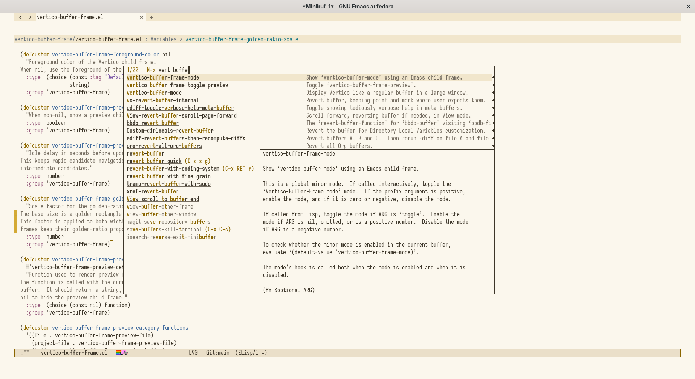
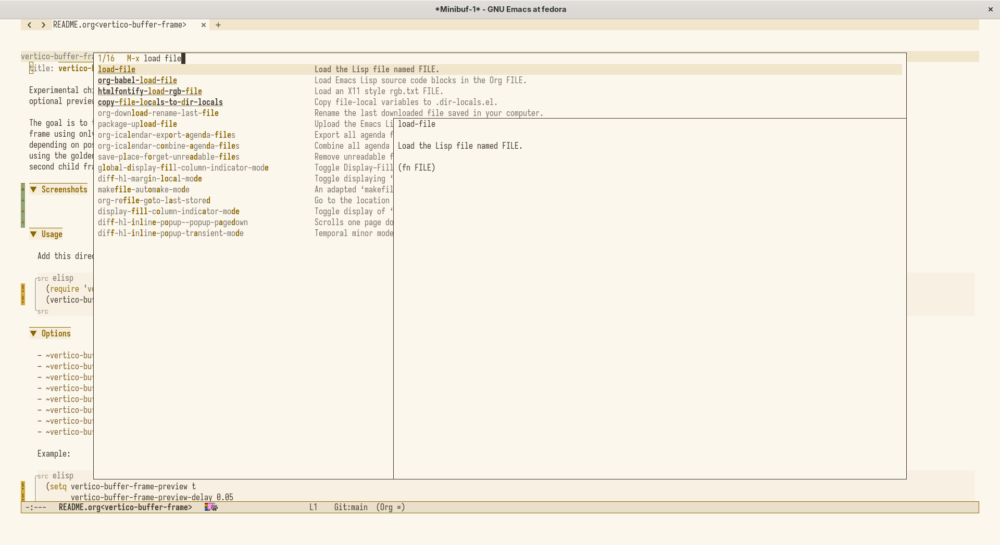
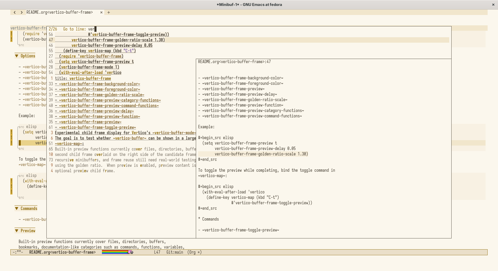
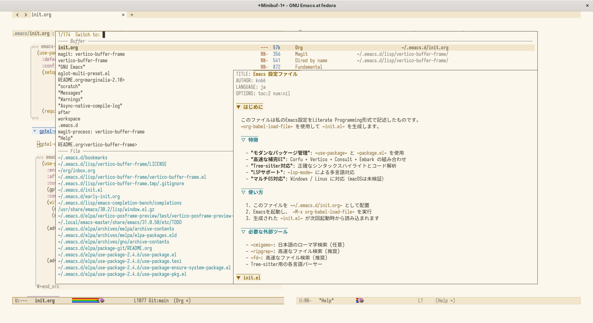

#+title: vertico-buffer-frame

Experimental child frame display for Vertico's ~vertico-buffer-mode~, with an
optional preview child frame.

The goal is to test whether ~vertico-buffer~ can be shown in a larger child
frame using only Emacs' built-in ~display-buffer-in-child-frame~, without
depending on posframe.  The candidate and preview frames are sized as golden
rectangles, and the remaining parent-frame margins are split by the golden
ratio.  When preview is enabled, preview content is shown in a second child
frame overlaid on the right side of the candidate frame.

* GIF

[[file:gif/vertico-buffer-frame.gif]]

* Screenshots
:PROPERTIES:
:ID:       ac9e8bfa-0dd4-4897-8d4c-147be0f7f1e6
:END:

** vertico-buffer-frame-golden-ratio-scale = 1.00

#+DOWNLOADED: screenshot @ 2026-05-04 20:20:38

** vertico-buffer-frame-golden-ratio-scale = 1.30

** execute-extended-command

:PROPERTIES:
:ID:       4c66979b-9216-4dd3-8878-2634389105bc
:END:

#+DOWNLOADED: screenshot @ 2026-05-04 19:33:56

** consult-line

#+DOWNLOADED: screenshot @ 2026-05-04 19:34:30

** consult-buffer
:PROPERTIES:
:ID:       3fb4bfd7-b65d-4aa3-b1e3-623149b4b89b
:END:

#+DOWNLOADED: screenshot @ 2026-05-04 19:37:29

* Usage

Add this directory to ~load-path~, then:

#+begin_src elisp
  (require 'vertico-buffer-frame)
  (vertico-buffer-frame-mode 1)
#+end_src

* Options

- ~vertico-buffer-frame-background-color~
- ~vertico-buffer-frame-foreground-color~
- ~vertico-buffer-frame-preview~
- ~vertico-buffer-frame-preview-delay~
- ~vertico-buffer-frame-golden-ratio-scale~
- ~vertico-buffer-frame-preview-function~
- ~vertico-buffer-frame-preview-category-functions~
- ~vertico-buffer-frame-preview-command-functions~

Example:

#+begin_src elisp
  (setq vertico-buffer-frame-preview t
        vertico-buffer-frame-preview-delay 0.05
        vertico-buffer-frame-golden-ratio-scale 1.00)
#+end_src

To toggle the preview while completing, bind the toggle command in
~vertico-map~:

#+begin_src elisp
  (with-eval-after-load 'vertico
    (define-key vertico-map (kbd "C-t")
                #'vertico-buffer-frame-toggle-preview))
#+end_src

* Commands

- ~vertico-buffer-frame-toggle-preview~

* Preview

Built-in preview functions currently cover files, directories, buffers,
bookmarks, documentation-like categories such as commands, functions, variables,
symbols and faces, text-like categories such as kill-ring and expressions, and
location-like candidates from common completion categories such as Consult grep,
Consult compile errors, Consult Flymake diagnostics, Consult Info, imenu, Org
headings and xref.

This is intentionally a small experiment scaffold.  Focus handling, placement,
recursive minibuffers, and frame reuse still need real-world testing.
