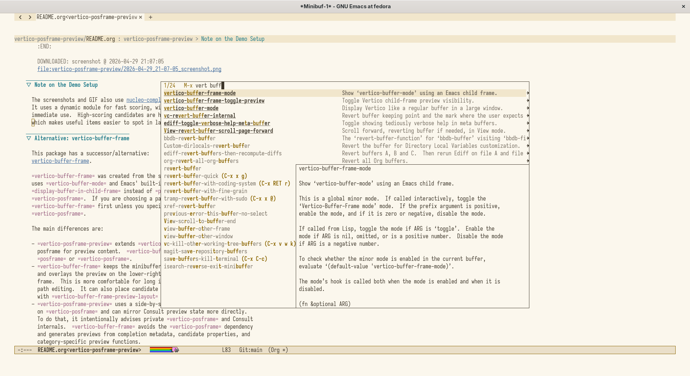
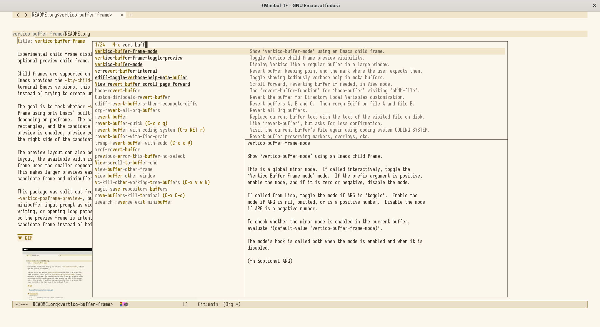
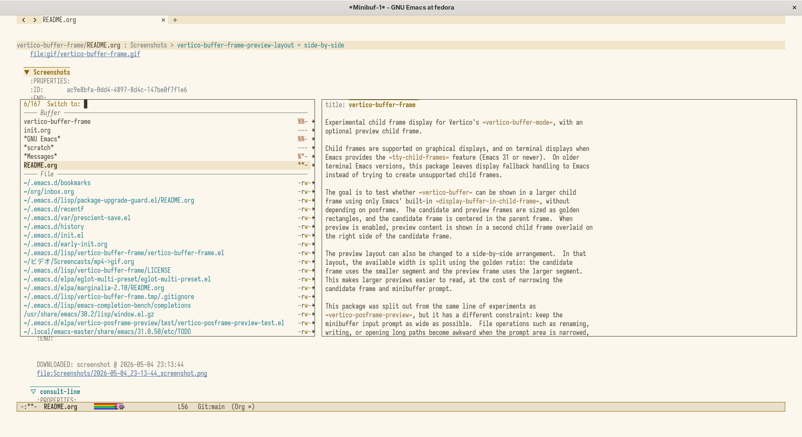
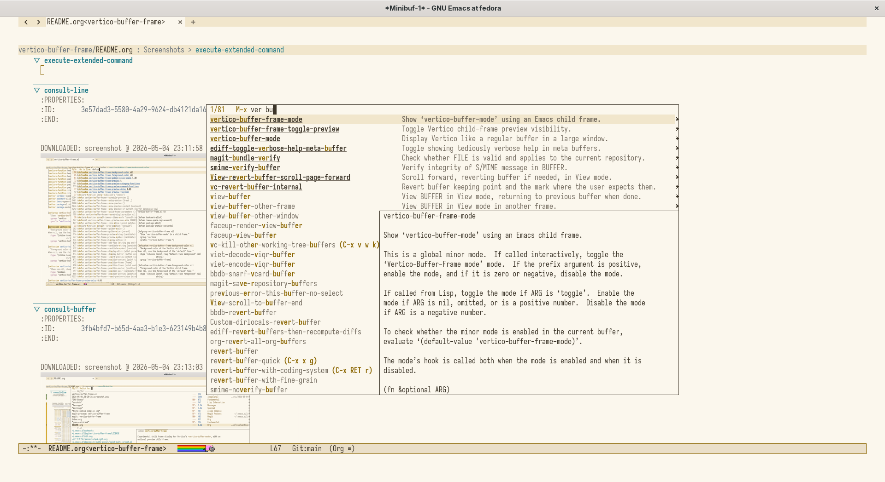
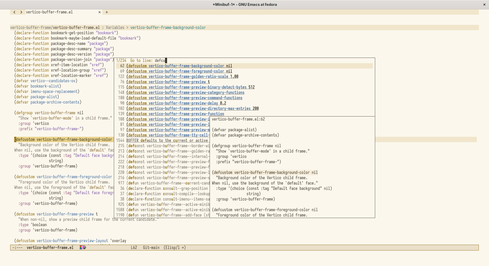
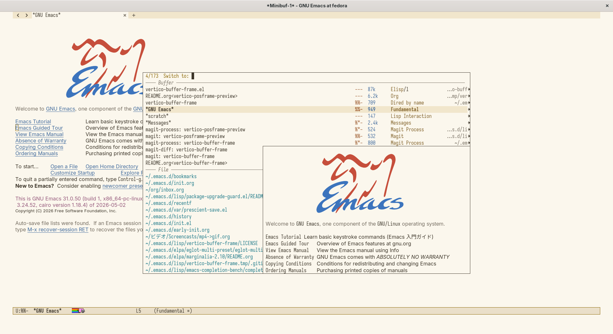

#+title: vertico-buffer-frame

Experimental child frame display for Vertico's ~vertico-buffer-mode~, with an
optional preview child frame.

Child frames are supported on graphical displays, and on terminal displays when
Emacs provides the ~tty-child-frames~ feature (Emacs 31 or newer).  On older
terminal Emacs versions, this package leaves display fallback handling to Emacs
instead of trying to create unsupported child frames.

The goal is to test whether ~vertico-buffer~ can be shown in a larger child
frame using only Emacs' built-in ~display-buffer-in-child-frame~, without
depending on posframe.  The candidate and preview frames are sized as golden
rectangles, and the candidate frame is centered in the parent frame.  When
preview is enabled, preview content is shown in a second child frame overlaid on
the right side of the candidate frame.

The preview layout can also be changed to a side-by-side arrangement.  In that
layout, the available width is split using the golden ratio: the candidate
frame uses the smaller segment and the preview frame uses the larger segment.
This makes larger previews easier to read, at the cost of narrowing the
candidate frame and minibuffer prompt.

This package was split out from the same line of experiments as
~vertico-posframe-preview~, but it has a different constraint: keep the
minibuffer input prompt as wide as possible.  File operations such as renaming,
writing, or opening long paths become awkward when the prompt area is narrowed,
so the preview frame is intentionally overlaid on the lower-right part of the
candidate frame instead of being placed side by side with the input area.

* GIF

[[file:gif/vertico-buffer-frame.gif]]

* Screenshots
:PROPERTIES:
:ID:       ac9e8bfa-0dd4-4897-8d4c-147be0f7f1e6
:END:

** vertico-buffer-frame-golden-ratio-scale = 1.00
:PROPERTIES:
:ID:       520b8f05-76d8-49e0-8083-75757203bed0
:END:

#+DOWNLOADED: screenshot @ 2026-05-05 21:26:08

** vertico-buffer-frame-golden-ratio-scale = 1.30
:PROPERTIES:
:ID:       0827939c-4393-4151-87f2-61202becb885
:END:

#+DOWNLOADED: screenshot @ 2026-05-05 21:27:35

** vertico-buffer-frame-preview-layout = side-by-side
:PROPERTIES:
:ID:       375aad3e-79d8-43fe-b65f-2b6d00723fc6
:END:

#+DOWNLOADED: screenshot @ 2026-05-05 21:04:19

** execute-extended-command
:PROPERTIES:
:ID:       48e031c9-7993-4613-bc41-40f98a99a25a
:END:

#+DOWNLOADED: screenshot @ 2026-05-05 21:29:08

** consult-line
:PROPERTIES:
:ID:       3e57dad3-5580-4a29-9624-db4121da161f
:END:

#+DOWNLOADED: screenshot @ 2026-05-05 21:30:14

** consult-buffer
:PROPERTIES:
:ID:       3fb4bfd7-b65d-4aa3-b1e3-623149b4b89b
:END:

#+DOWNLOADED: screenshot @ 2026-05-05 21:30:41

* Usage

Add this directory to ~load-path~, then:

#+begin_src elisp
  (require 'vertico-buffer-frame)
  (vertico-buffer-frame-mode 1)
#+end_src

* Options

- ~vertico-buffer-frame-background-color~
- ~vertico-buffer-frame-foreground-color~
- ~vertico-buffer-frame-preview~
- ~vertico-buffer-frame-preview-layout~
- ~vertico-buffer-frame-preview-delay~
- ~vertico-buffer-frame-preview-max-size~
- ~vertico-buffer-frame-preview-directory-max-entries~
- ~vertico-buffer-frame-preview-io-timeout~
- ~vertico-buffer-frame-preview-binary-detect-bytes~
- ~vertico-buffer-frame-golden-ratio-scale~
- ~vertico-buffer-frame-tty-cell-height-ratio~
- ~vertico-buffer-frame-preview-function~
- ~vertico-buffer-frame-preview-category-functions~
- ~vertico-buffer-frame-preview-command-functions~

Example:

#+begin_src elisp
  (setq vertico-buffer-frame-preview t
        vertico-buffer-frame-preview-layout 'overlay
        vertico-buffer-frame-preview-delay 0.2
        vertico-buffer-frame-preview-io-timeout 0.3
        vertico-buffer-frame-golden-ratio-scale 1.00)
#+end_src

To place the preview beside the candidates instead of overlaying it:

#+begin_src elisp
  (setq vertico-buffer-frame-preview-layout 'side-by-side)
#+end_src

To toggle the preview while completing, bind the toggle command in
~vertico-map~:

#+begin_src elisp
  (with-eval-after-load 'vertico
    (define-key vertico-map (kbd "C-t")
                #'vertico-buffer-frame-toggle-preview))
#+end_src

* Commands

- ~vertico-buffer-frame-toggle-preview~

When called during completion, ~vertico-buffer-frame-toggle-preview~ changes
preview visibility only for the current minibuffer session.  When called
outside the minibuffer, it changes the global default
~vertico-buffer-frame-preview~.

* Preview

Built-in preview functions currently cover files, directories, buffers,
bookmarks, documentation-like categories such as commands, functions, variables,
symbols and faces, text-like categories such as kill-ring and expressions, and
location-like candidates from common completion categories such as Consult grep,
Consult compile errors, Consult Flymake diagnostics, Consult Info, imenu, Org
headings and xref.

This is intentionally a small experiment scaffold.  Focus handling, placement,
recursive minibuffers, and frame reuse still need real-world testing.

* Difference from vertico-posframe-preview

[[https://github.com/kn66/vertico-posframe-preview][vertico-posframe-preview]] is a related package which adds a second posframe for
preview content beside the candidate posframe shown by ~vertico-posframe~.  This
package does not depend on ~posframe~ or ~vertico-posframe~; it uses
~vertico-buffer-mode~ and Emacs' built-in ~display-buffer-in-child-frame~
instead.

The main differences are:

- ~vertico-buffer-frame~ depends only on Emacs and Vertico, while
  ~vertico-posframe-preview~ depends on ~posframe~ and ~vertico-posframe~.
- ~vertico-buffer-frame~ keeps the minibuffer prompt width intact and overlays
  the preview on the lower-right side of the candidate frame.  This favors long
  input workflows, such as file rename and path editing.  It can optionally use
  ~vertico-buffer-frame-preview-layout~ set to ~side-by-side~ for a non-overlap
  layout with a golden-ratio width split.
- ~vertico-posframe-preview~ places candidate and preview frames side by side
  by default and follows the ~vertico-posframe~ configuration model.  This can
  make large previews easier to read, but it is a different layout tradeoff.
- ~vertico-buffer-frame~ avoids advising ~vertico-posframe~ and Consult preview
  internals.  It previews candidates from completion metadata, text properties,
  and category-specific functions.  ~vertico-posframe-preview~ mirrors Consult
  preview state more directly, but it intentionally advises private APIs.
- Both packages guard preview file I/O by skipping remote paths, bounding local
  I/O, skipping binary files, and limiting directory previews.

The reason for this package is therefore not to replace
~vertico-posframe-preview~ feature-for-feature.  It is to explore a lighter
child-frame display path for Vertico which preserves the prompt area and avoids
the extra posframe dependency.

* Tests

Run the non-graphical unit tests with:

#+begin_src sh
  emacs --batch -Q \
        --eval "(setq load-prefer-newer t)" \
        --eval "(progn (require 'package) (package-initialize))" \
        -L . \
        -l test/vertico-buffer-frame-test.el \
        -f ert-run-tests-batch-and-exit
#+end_src
